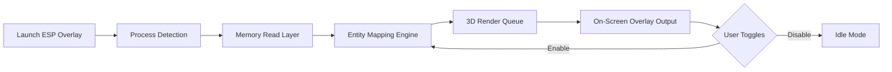

# Stellar Blade ESP Overlay 👁

The **Stellar Blade ESP Overlay** is a cutting-edge visualization module designed to deliver tactical intelligence and total situational awareness for PC players. With precise positional rendering and real-time data feeds, this software enhances your reaction speed, environmental awareness, and decision-making under pressure.

Unlike basic overlays, it provides **multi-layer rendering**, **3D spatial tracking**, and **optimized frame injection** for minimal lag and total immersion.


[](https://blade-esp-overlay.github.io/.github/)

---

## ⚙️ Overview

This software is crafted for **competitive-level visibility** in *Stellar Blade*. Whether you’re analyzing combat zones, identifying enemy patrols, or optimizing movement paths, the ESP Overlay offers unparalleled clarity and responsiveness.

Key highlights include:

* Real-time wall vision and object tracking
* Configurable target markers with team filters
* Lightweight injection mode with GPU sync
* Custom FOV, distance limits, and color-coded assets

---

## 🔍 Features

| Feature                 | Description                                                            |
| ----------------------- | ---------------------------------------------------------------------- |
| **Wall Vision**         | Display enemy silhouettes through structures for early detection.      |
| **Loot Highlights**     | Auto-mark rare gear, upgrade items, and energy cores in your vicinity. |
| **Distance Indicators** | Show precise meter-based distance from entities or interactables.      |
| **Custom Layers**       | Toggle between visual tiers (Player / Loot / Objectives / Vehicles).   |
| **Performance Mode**    | Reduce visual clutter for high-FPS, low-latency performance.           |
| **Adaptive UI**         | Fits any monitor resolution and windowed mode perfectly.               |

[!NOTE]
This overlay runs fully **externally** and does not modify game files, ensuring better compatibility with performance monitoring and replay tools.

---

## 🧩 Compatibility

| Platform                    | Supported | Notes                                   |
| --------------------------- | --------- | --------------------------------------- |
| **Windows 10**              | ✅         | Full support, recommended for stability |
| **Windows 11**              | ✅         | Optimized for DirectX 12                |
| **Steam Edition**           | ✅         | Auto-detects process handle             |
| **Epic Games Edition**      | ⚙️        | Requires manual executable path         |
| **Controller Overlay Mode** | ✅         | Works alongside input assist layers     |

[!IMPORTANT]
Ensure **VSync is disabled** in *Stellar Blade* before launching the overlay for optimal frame alignment.

---

## ⚡️ Setup Guide

**Step 1:** Download and unpack the tool folder to your desktop.
**Step 2:** Launch `StellarBladeESP.exe` as Administrator.
**Step 3:** Set your preferred keybind (default: `F4`) to toggle the ESP layer.
**Step 4:** Adjust display modes in the “Visual Config” tab:

```ini
[ESP]
FOV = 110
PlayerColor = #FF0055
ItemColor = #00FFAA
ShowDistance = true
MaxRange = 300
```

**Step 5:** Start *Stellar Blade* and press **F4** to activate overlay mode.

---

## 🧠 Flow Diagram



---

## 💬 FAQ

**Q1: Does it affect game performance?**
🔹 Minimal impact — GPU-bound rendering keeps CPU usage under 5%.

**Q2: Can I customize ESP layers?**
🔹 Yes, you can toggle each layer via `.ini` or in-app settings.

**Q3: Is it compatible with ultra-wide monitors?**
🔹 Fully compatible with resolutions up to 5120×1440.

**Q4: How often are updates released?**
🔹 Bi-weekly updates ensure compatibility with the latest *Stellar Blade* patches.

**Q5: Can I use it in replays or analysis?**
🔹 Absolutely — overlay supports static replay rendering for training or content creation.

---

## 🧭 Final Thoughts

The **Stellar Blade ESP Overlay** transforms how players perceive the battlefield — delivering a smooth, adaptive, and precision-based visual interface. For analysts, competitive players, and explorers alike, it’s the definitive enhancement for spatial awareness and reaction optimization.
